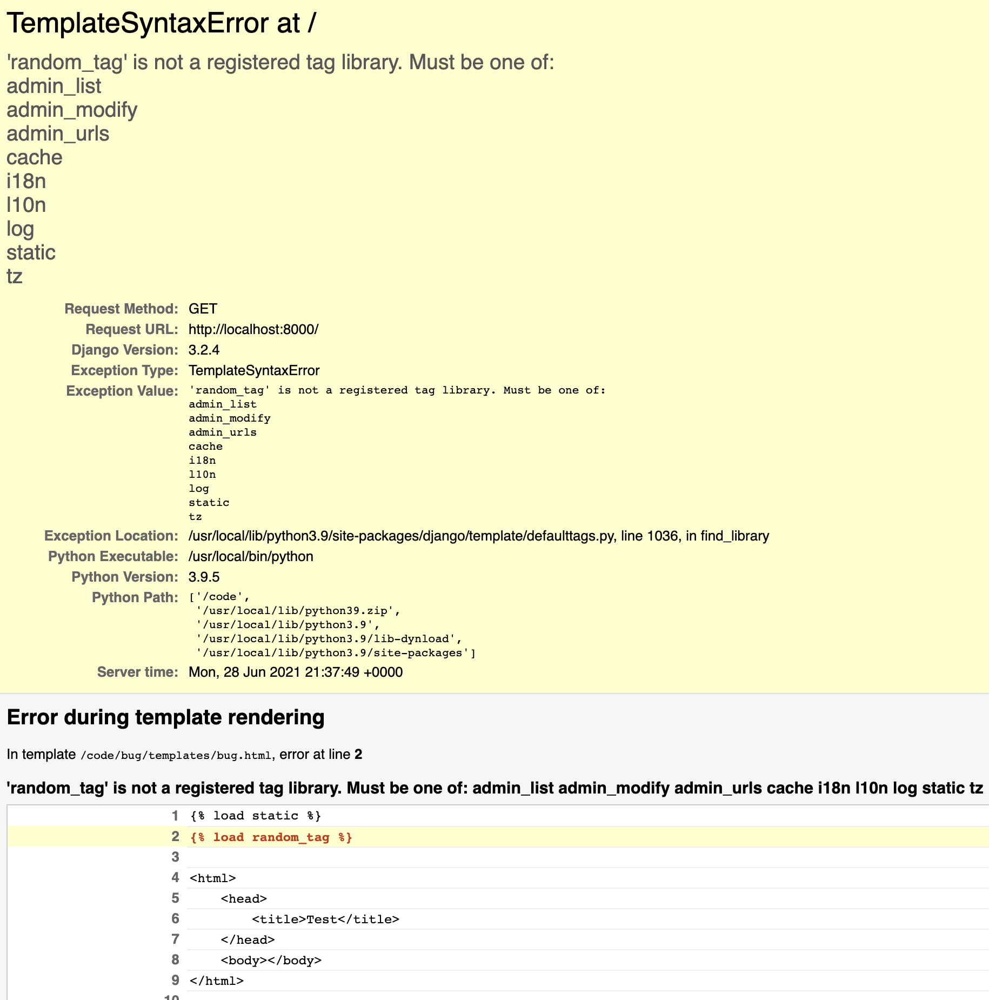
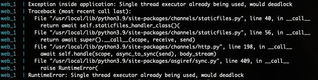
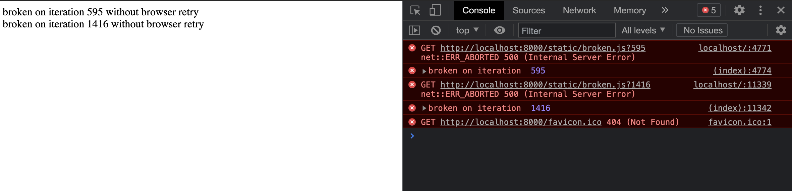

# asgiref-thread-bug

## How to get the bug to trigger

```
git clone https://github.com/rdmrocha/asgiref-thread-bug.git

cd asgiref-thread-bug

docker-compose up
```
After that, access http://localhost:8000 on your browser
<hr>

## Expected outcome

<hr>

## Bug triggered on Asgiref/Channels


<hr>

## How to switch between asgiref versions

- edit requirements.txt
- comment/uncomment version 3.3.4/3.4.1 accordingly, save the file
- re-run ```docker-compose up```
- access http://localhost:8000 on your browser again
