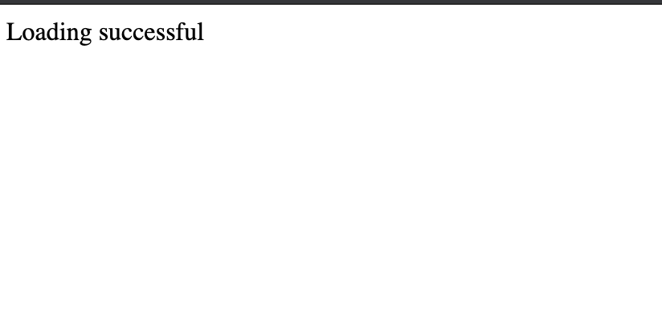

# asgiref-thread-bug

## How to get the bug to trigger

```
git clone https://github.com/rdmrocha/asgiref-thread-bug.git

docker-compose up
```
After that, access http://localhost:8000 on your browser

### Expected


### Bug triggered on Asgiref


## How to switch between asgiref versions

- edit requirements.txt
- comment/uncomment version 3.3.4/3.4.0 accordingly, save the file
- re-run ```docker-compose up```
- access http://localhost:8000 on your browser again
